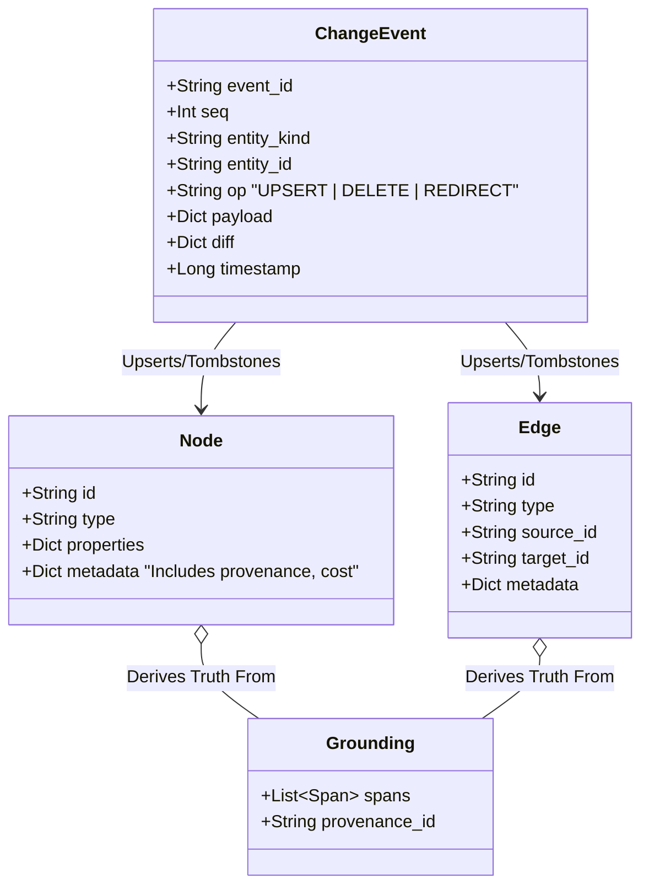
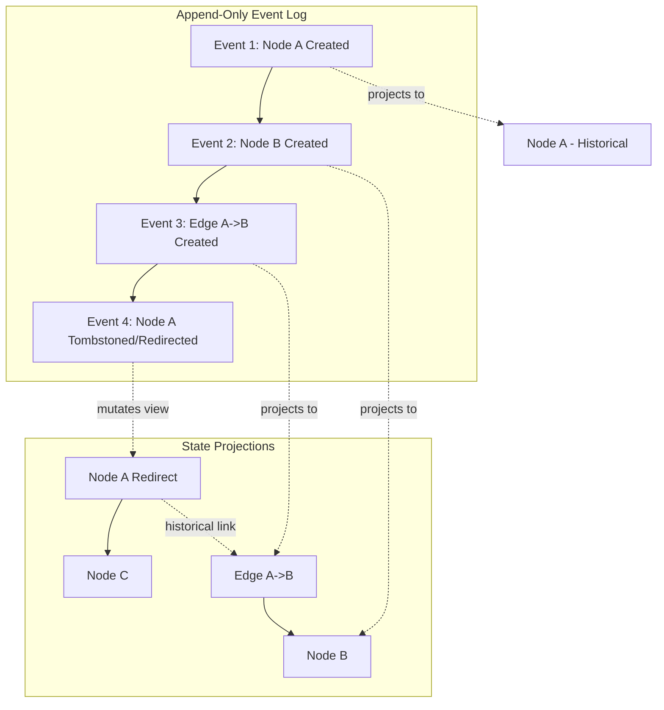

# Relational Execution Substrate Architecture

This document outlines the core architecture of the Relational Execution Substrate based on the non-negotiable principles of provenance, relationship-first modeling, append-only events, and deterministic replayability.

## 1. Conceptual Model

The substrate is modeled around four primary primitives:

*   **Nodes (Entities):** Represent atomic concepts, knowledge snippets, conversation turns, workflow states, or system states. They do not hold mutable truth, but rather reflect a projection of state at a given time. Examples: `Node`, `DocNode`, `LLMNode`, `Document`.
*   **Edges (Relationships):** Explicit relationships connecting two nodes. They encode causal, temporal, dependency, or provenance links. They are first-class citizens in the graph. Examples: `Edge`, `LLMEdge`.
*   **Events (ChangeEvent):** The append-only source of truth. Every mutation in the system is captured as an event (`ChangeEvent`) in an event log (`oplog` / `append_entity_event`).
*   **Projections / Indexes:** Derived views (e.g., Chroma vectors, PostgreSQL views, in-memory graphs) built deterministically by replaying the event log. 

### Node/Edge/Event Definitions (Mermaid)



## 2. Relationship Graph

The core philosophy is "Relationship > Structure". The substrate operates by traversing edges that denote dependency and causality.



## 3. Invariants

To maintain correctness, the substrate enforces strict invariants:

1.  **Provenance First:** Every node/edge derived from an external source or LLM must maintain a `Grounding`/`Span` reference back to its origin `Document`. No floating assertions are permitted.
2.  **Append-Only State:** `ChangeEvent` records are strictly append-only. Entities are never physically deleted; they are `tombstoned` or `redirected` (`tombstone_node`, `redirect_node`).
3.  **Deterministic Projection:** Given the same sequence of events, the underlying storage (PostgreSQL/Chroma) must always reconstruct the identical state graph.
4.  **Edge Endpoint Integrity:** An edge must only point to valid, non-tombstoned nodes. If a node is redirected, queries must automatically resolve the `redirect_chain` (handled by `_resolve_redirect_chain`).
5.  **Monotonic Clocks:** Global and User sequence numbers (`next_global_seq`, `next_user_seq`) strictly increase, ensuring total causal ordering of events.

## 4. Failure Modes

Designing for distributed correctness means anticipating these failure modes:

*   **Projection Lag:** The CDC stream (`ChangeBus`) may be delayed, causing the projected index (Chroma) to temporarily drift from the authoritative event log (PostgreSQL).
    *   *Mitigation:* Read requests can specify an `expected_version` or query `search_nodes_as_of` to block until projection catches up.
*   **Redirect Cycles:** Malformed updates could create an infinite loop of redirects (A -> B -> C -> A).
    *   *Mitigation:* Traversal bounds in `_resolve_redirect_chain` abort on cycle detection.
*   **Split-Brain Replay:** Replaying events out of order could corrupt the projection.
    *   *Mitigation:* Sequence numbers (`seq`) are enforced monotonically. Index jobs verify `fingerprint` states before applying.
*   **Dangling Edges:** A node is tombstoned, but an edge still points to it.
    *   *Mitigation:* Substrate logic (`LifecycleSubsystem.tombstone_node`) automatically cleans up or cascades tombstones/redirects to dependent edges, maintaining referential integrity.

## 5. Patch (Diff-Style)

In this substrate, you do not use `UPDATE my_table SET val=1`. You append an event. Here is how a semantic "patch" is represented in the system log when updating a Node's property or redirecting it:

```diff
  // Event Log Append
  {
    "event_id": "evt-01J...",
    "seq": 402,
    "entity_kind": "node",
    "entity_id": "node-user-123",
-   "op": "UPDATE", // INCORRECT: We do not update in place
+   "op": "UPSERT",
    "payload": {
      "id": "node-user-123",
      "type": "Person",
      "properties": {"name": "Alice"}
    },
+   "diff": { // Captures exactly what changed for downstream CDC
+     "properties.name": ["Alicia", "Alice"] 
+   }
  }

  // Redirecting a merged entity (Semantic Delete)
  {
    "event_id": "evt-01J...",
    "seq": 403,
    "entity_kind": "node",
    "entity_id": "node-user-old",
+   "op": "REDIRECT",
+   "payload": {"redirect_to": "node-user-123"}
  }
```

## 6. Tests

Tests in this substrate do not verify "did the function return True". They verify invariants over time and state permutations.

**Core Test Strategies:**
1.  **Replay Invariance Test:** 
    *   *Action:* Generate graph states -> serialize to events -> wipe database -> replay events.
    *   *Assertion:* `assert initial_graph_hash == replayed_graph_hash`.
2.  **Redirect Resolution Test:**
    *   *Action:* Create `Node A` -> Create `Edge E (A->B)` -> Redirect `Node A` to `Node C`.
    *   *Assertion:* `assert query_edges(E).source == Node C`. (The system dynamically resolves the edge endpoint).
3.  **Provenance Integrity Test:**
    *   *Action:* Create LLM generated `Node` based on `Document D`. Tombstone `Document D`.
    *   *Assertion:* Queries for the `Node` should reflect its grounded context is invalid/stale, or cascade the tombstone, depending on strictness policy.
4.  **Monotonic Sequence Test:**
    *   *Action:* Fire concurrent mutations from multiple threads.
    *   *Assertion:* Event log `seq` numbers have absolutely no gaps or duplicates, and all projections strictly reflect the final `max(seq)`.