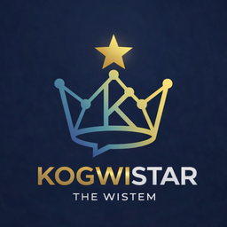

  

<h1 align="center">Kogwistar</h1>

<h4 align="center">AI substrate system, from provenance to wisdom where execution becomes reusable memory</h4>

Graph / Hypergraph-Native execution, memory and observability substrate for AI systems

Build knowledge graphs, workflow runtimes, conversation memory, and provenance systems
as a single substrate for AI agents. 

Open-source substrate and harness for AI agent systems.

  
  
  
  

`kogwistar` is a graph/hypergraph-native substrate with an embedded workflow/runtime harness layer.

It treats knowledge, conversation, workflow/runtime, provenance, and future wisdom(long-term distilled knowledge) as one connected substrate.

**It is better understood as a graph-native memory and execution substrate than as only another GraphRAG repository.**

The quickest way to understand this is the graph-native artifact demo below.

To **Data scientists**: This is the plug and play hypergraphrag you looking for
To **Engineers**:       This is the harness/substrate for robust systems  
To **Researchers**:    You have imaginative ways to use it  

Kogwistar is not an agent framework.  
It is a substrate for building your own agent systems, with built-in guarantees around execution, memory, and provenance.

If you are looking for a graph-native substrate, workflow/runtime harness, or graph-native memory system, this repo is positioned in that category. For example, it can support agent loops where workflows dynamically define and execute sub-tasks, similar to emerging recursive agent execution patterns. 

Today the repo implements graph memory and query, workflow design/runtime, provenance and replay-oriented surfaces, CDC/event-oriented patterns, and self-hostable development paths.

This repo is a substrate, that means, some basic blocks are given. Specific examples are given, and you can build your own system by composing. The substrate is designed to provide strong guarantees (such as replayability, provenance tracking, and projection), particularly along the authoritative evented path.

## Harness and Substrate

Kogwistar is both a graph-native substrate and a workflow/runtime harness, but the labels apply to different layers. The substrate is the shared node/edge/event foundation: workflow structure, conversation structure, knowledge, provenance, and replayable history are modeled on the same primitives, and authoritative history can be projected back into materialized views. That is the layer the repo is trying to keep stable over time.

The harness is the execution layer on top of that foundation. The repository includes a native workflow/runtime engine, step orchestration, conversation and workflow execution surfaces, and MCP-facing control paths that make the graph design runnable. In that sense it overlaps with harness and orchestration frameworks, while remaining tied to the graph-native model underneath.

The distinction matters because not every low-level path carries the same guarantees. The authoritative evented path is where replay, provenance, and projection semantics are strongest; lower-level primitives remain exposed for advanced builders who want custom composition or reduced ceremony. Compared with runtime-first frameworks such as LangGraph, this repo is runtime-overlapping but semantically broader: it tries to unify execution, structure, and provenance on one graph-native system model rather than treating the runtime as the only product surface.

## Graph-Native Artifact Pipeline

This is the clearest demo if you want to see how execution, memory, conversation, and provenance are unified in one graph.

Run the full suite with:

`python -m kogwistar.demo.graph_native_artifact_demo`

Use `--summary-only` if you want the one-screen proof view instead of the full report.

The demo runs three small scenarios:

1. execution becomes memory
2. conversation and workflow live in the same graph
3. provenance answers “why” from stored execution history

These are not separate features; they come from the same underlying graph model.

The example stages raw notes, validates them, normalizes them into graph artifacts, links related notes, and commits the result into the same graph store that also holds workflow runs, step executions, and conversation turns. That makes the substrate point visible: execution is not just logged, it becomes graph memory; conversation and workflow are linked in one graph; and provenance queries can explain a result from stored history.

See [docs/graph_native_artifact_demo.md](docs/graph_native_artifact_demo.md) for the short design note.

If you want the closer agent-loop comparison, the older [framework_then_agent_demo](docs/framework_then_agent_demo.md) remains available as a companion example.

## Quickstart

- As this is a substrate, you can pick anywhere you immediately want to start with e.g. hypergraphrag, runtime, mcp server, conversation primitives, workflow design. As you need grows, you can compose more consisntently and coherently.

- Standalone setup then run simple flow in 2 minutes. (no frontend integration): [QUICKSTART.md](QUICKSTART.md)

- Detailed comparison with adjacent products/frameworks: [docs/llm-generated-comparison.md](docs/llm-generated-comparison.md)
- Author notes, build context, and design history: [docs/author-notes.md](docs/author-notes.md)
- Runtime rationale: [kogwistar/docs/ARD-custom-runtime-rationale.md](kogwistar/docs/ARD-custom-runtime-rationale.md)
- Local conversation walkthrough: [docs/tutorials/conversation-pipeline-basics.md](docs/tutorials/conversation-pipeline-basics.md)

- Roadmap and research direction: [docs/roadmap.md](docs/roadmap.md)

- Alternatively, let your AI agent read throught and set up the credential/ keys and environemnt variables for you, and run the appropriate commands.

## Core Features

- Graph/hypergraph-oriented memory and query surfaces. 
- Knowledge can go outdated. Trace available knowledge/graph status back in any time.
- Workflow design stored as graph structure, with runtime, replay, and event-oriented execution seams.
- Support conversation execution events stored as hypergraph/graph
- CDC-oriented graph updates and replay workflows. (Observability is FREE, NOT freemium!)
- Provenance-heavy first class primitives with lifecycle-aware and temporal retrieval support.
- Multiple storage backends, including Chroma and PostgreSQL/pgvector paths. With dual-store eventual consistency or transactional atomicity.
- MCP/ REST tooling surface for graph query, extraction, and admin operations.
- Visualization helpers for D3 payloads.
- Security design, servers with RBAC, namespaces. LLM call has built-in privacy guards. Data model has slice guards to prevent data leakage.
- Since everything is node and each node has provenance and embeddings, besides graph algorithms, you can trace provenence down everything and semantically search trace logs, design nodes, conversation nodes. Future conversation can semantically search past history for wisdom.

## How This Differs

- Unlike typical agent products, this repo centers a unified graph/hypergraph substrate, more than only chat, skills, or tool orchestration.
- Unlike workflow-first frameworks, it treats provenance, replay, and event history (event source) as part of the core data model rather than secondary runtime features.
- Compared with local/self-hosted agent products, it emphasizes graph-native memory and workflow design seams more than channel breadth or app-registry breadth.
- It spans retrieval, memory, runtime, and provenance concerns together, so it maps less cleanly to a single existing OSS category.

## Application Best Fit

- A strong base platform for building audit-heavy systems, ranging from local personal agents to scalable AI backends.
- Best suited for use cases where provenance, replay, lifecycle-aware retrieval, and workflow history matter.
- Designed to run efficiently on normal local machines (via SQLite/Chroma or lightweight Docker with PostgreSQL/pgvector).
- A foundation repo, not yet a finished enterprise product.
- Personal use that require robustness and stability.
- Collect data for future AI wisdom on what and how to do things.

## Security Support

- Role- and namespace-based access control across API and MCP surfaces.
- OIDC/PKCE support for authenticated deployments, with simpler dev-mode auth for local work.
- Sandboxable runtime paths, including container-based execution with networking disabled by default.
- Security-aware boundaries are part of the design, but this repo should still be treated as a foundation platform rather than a fully hardened security product.

## Research Direction

- Move toward privacy-first personal agents with stronger local-first memory and execution.
- Distill conversation and workflow traces into a future wisdom layer.
- Explore agents that can propose and revise their own workflow graphs under human-auditable constraints.
- These are research directions and design seams, not completed product claims.
  Runtime design rationale: [kogwistar/docs/ARD-custom-runtime-rationale.md](kogwistar/docs/ARD-custom-runtime-rationale.md)
- Research application note: [docs/research-applications.md](docs/research-applications.md)

## Why This Repo Exists

- Raise the engineering bar for graph-native agent systems.
- Lower the barrier to entry for building high-quality agent memory and execution layers on normal local hardware.
- Provide a reusable foundation where retrieval, memory, workflow, and provenance are already structurally integrated.
  Additional motivation, build-cost context, and design history: [docs/author-notes.md](docs/author-notes.md)

## Important Tool Sets

- Graph substrate and provenance toolkit for storing nodes, edges, grounding, lifecycle state, and replayable graph changes as first-class primitives.
- Conversation and retrieval orchestration toolkit for building local conversation flows, memory retrieval, KG retrieval, evidence pinning, and workflow-driven v2 turn execution.
- Workflow runtime and replay toolkit for graph-defined execution, checkpoints, joins, suspend/resume flows, and inspectable run traces.
- LLM task abstraction and strategy toolkit for provider-neutral extraction, filtering, summarization, answering, citation repair, verification, and merge/adjudication behavior.
- Server and MCP integration toolkit for exposing conversations, workflow runs, admin operations, and graph tooling through app and tool boundaries.
- Tutorial, CDC, and debugging toolkit for local development ladders, event-stream inspection, CDC viewers, and operational debugging workflows.

## Run (Development)

1. Clone the repo and enter it.
   - `git clone git@github.com:humblemat810/kogwistar.git`
   - Or HTTPS: `git clone https://github.com/humblemat810/kogwistar.git`
   - `cd kogwistar`
2. Create and activate a Python 3.13 environment.
3. Install dependencies for local work.
4. Pick a development mode:
   - Server-style MCP app:
     - Install with `pip install -e ".[server,chroma]"` and start the app with `knowledge-mcp` (defaults to port `28110`).
   - CLI-style workflow/runtime loop:
     - Use the standalone tutorial/runtime script in [QUICKSTART.md](QUICKSTART.md) under `scripts/claw_runtime_loop.py`.
     - This mode is useful for local development when you want to iterate on workflow execution, CDC flow, and event-loop behavior without running the full server surface.

## Development and Test Install

- Minimal engine core:
  - `pip install -e .`
- Lightweight local development:
  - `pip install -e ".[server,chroma,test]"`
- Development with LangGraph-related tests:
  - `pip install -e ".[server,chroma,test,langgraph]"`
- PostgreSQL parity/integration work:
  - `pip install -e ".[server,pgvector,test]"`
- Full local contributor setup:
  - `pip install -e ".[full,test]"`

## Run Tests

- Run the default test suite:
  - `pytest`
- Run a specific test file:
  - `pytest tests/workflow/test_save_load_progress.py -q`
- Real Keycloak OIDC end-to-end test:
  - `pytest tests/server/test_oidc_keycloak_e2e.py -q`
- Browser-visible manual Keycloak OIDC test:
  - `pytest tests/server/test_oidc_keycloak_manual.py::test_oidc_keycloak_browser_manual --run-manual -q -s`
- Some integration tests may require Docker/testcontainers or optional extras such as `langgraph`.

## Install Options

- Base/core only:
  - `pip install -e .`
- Server/MCP runtime:
  - `pip install -e ".[server]"`
- Chroma backend:
  - `pip install -e ".[chroma]"`
- PostgreSQL + pgvector backend:
  - `pip install -e ".[pgvector]"`
- LLM provider (OpenAI):
  - `pip install -e ".[openai]"`
- LLM provider (Gemini):
  - `pip install -e ".[gemini]"`
- Ingestion with OpenAI:
  - `pip install -e ".[ingestion-openai]"`
- Ingestion with Gemini:
  - `pip install -e ".[ingestion-gemini]"`
- LangGraph converter:
  - `pip install -e ".[langgraph]"`
- Everything:
  - `pip install -e ".[full]"`

## GitHub Install

- Use the package name, not the repo name, when installing with extras from a repository.
- Examples:
  - `pip install "kogwistar[chroma] @ git+ssh://git@github.com/humblemat810/kogwistar.git@main"`
  - `pip install "kogwistar[pgvector,openai] @ git+ssh://git@github.com/humblemat810/kogwistar.git@<commit>"`
- For HTTPS-based installs, use the same direct-reference form with a token-authenticated `git+https://...` URL.

## Runtime Configuration

- `GKE_BACKEND=chroma|pg`
- Shared local persistence root:
  - `GKE_PERSIST_DIRECTORY=/path/to/data`
- Chroma-specific overrides:
  - `GKE_KNOWLEDGE_PERSIST_DIRECTORY`
  - `GKE_CONVERSATION_PERSIST_DIRECTORY`
  - `GKE_WORKFLOW_PERSIST_DIRECTORY`
  - `GKE_WISDOM_PERSIST_DIRECTORY`
  - Legacy `MCP_CHROMA_DIR*` envs still work.
- Postgres-specific settings:
  - `GKE_PG_URL`
  - `GKE_PG_SCHEMA`
  - `GKE_EMBEDDING_DIM`

## Local Docker / Compose

- Build and run with embedded Chroma persistence:
  - `docker compose --profile chroma up -d`
- Build and run with PostgreSQL + pgvector:
  - `docker compose --profile pg up -d`
- Start Keycloak only (OIDC dev realm):
  - `docker compose --profile auth up -d keycloak`
- Stop the stack:
  - `docker compose down`
- Stop and delete named volumes:
  - `docker compose down -v`
- The `chroma` profile uses an embedded Chroma-backed app container with named volumes.
- The `pg` profile starts both the app container and a `pgvector` Postgres container.

## Auth Modes

The server supports two auth modes controlled by `AUTH_MODE`:

- `AUTH_MODE=oidc` (default)
  - Uses OIDC Authorization Code + PKCE.
  - Compose defaults point to the local Keycloak realm imported from `keycloak/realm-kge.json`.
  - Default client: `kge-local` (public client).
  - Default user: `dev` / `dev`.
  - Required envs when running locally without compose:
    - `OIDC_DISCOVERY_URL`
    - `OIDC_CLIENT_ID`
    - `OIDC_REDIRECT_URI`
    - `UI_URL`

- `AUTH_MODE=dev`
  - Skips OIDC and issues an app JWT directly on `GET /api/auth/login`.
  - Defaults are configurable with:
    - `DEV_AUTH_EMAIL`, `DEV_AUTH_SUBJECT`, `DEV_AUTH_NAME`
    - `DEV_AUTH_ROLE`, `DEV_AUTH_NS`

### Windows note (Keycloak realm volume)

`compose.yml` uses a relative bind mount for `keycloak/realm-kge.json`. On Windows with Docker Desktop, this is the most reliable option.

Best practices:

- Keep the realm file inside the repo (relative path).
- Avoid drive-letter paths in `compose.yml` unless you must.
- Ensure the file exists before running `docker compose up`, otherwise Keycloak starts without importing.

## Misnomer
#### Relationship to LangGraph

LangGraph focuses on execution: it provides a strong runtime model for orchestrating stateful workflows with persistence and resume capabilities.

Kogwistar overlaps with that execution layer, but extends the system model by treating workflow structure, conversation structure, knowledge, and provenance as first-class graph entities. Rather than representing state primarily as messages or dictionaries, it aims to unify these domains on a shared node/edge/event substrate with replay and projection semantics.

The difference is not only in execution, but in what is considered part of the system’s core data model.
[Further details](kogwistar\docs\Differentiation_With_Langgraph.md)

## License

MIT. See [LICENSE](LICENSE).

#### Author Thoughts/ ideas
[Zen.md](ZEN.md)
