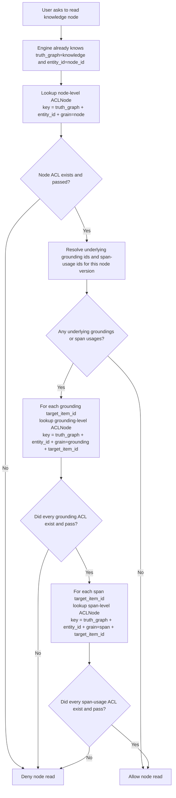
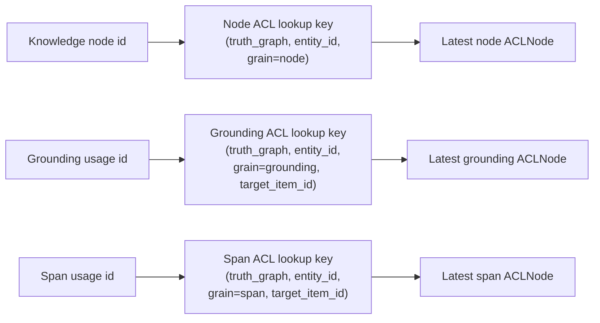
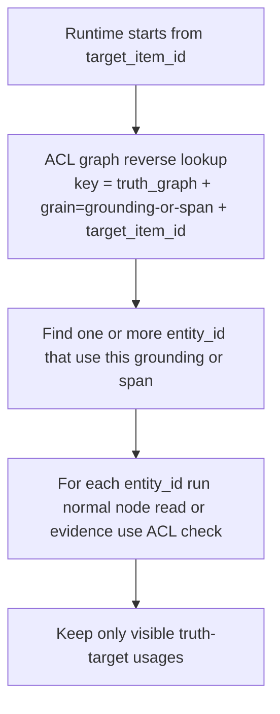

# Kogwistar Core ARD - User-Scoped Insertion and ACL-Graph Views

Status: Draft
Audience: Kogwistar Core maintainers and local coding agents
Scope: Core only; excludes app-specific share UX
Companion checklist: `docs/kogwistar_user_scoped_insertion_and_policy_view_checklist.md`

---

## 1. Problem Statement

Kogwistar Core now has meaningful identity, namespace, scope, and capability plumbing:

- subject and user identity can be derived from claims
- storage namespace, execution namespace, and security scope are available in runtime and server context
- capability-gated service actions exist
- visibility snapshot and inspection surfaces exist
- namespace-scoped engine views exist

That is strong groundwork, but it is not yet the same as a complete:

- user-scoped insertion model
- ACL-graph-driven visibility model

Today, Core appears to be:

- subject-aware
- scope-aware
- capability-aware

But not yet fully:

- per-user insertion-aware
- share-policy authoritative
- visibility-filtered at graph traversal and query time everywhere

This ARD defines gap, target design, and first safe slice.

---

## 2. Glossary

- `principal`: active subject whose rights are being evaluated. May be user, agent, service account, workflow actor, or any authenticated or authorized identity.
- `subject`: identity extracted from claims or runtime context.
- `truth graph`: any domain graph that stores domain facts, such as knowledge, conversation, or workflow.
- `ACL graph`: versioned overlay graph that stores visibility, sharing, and access facts for any truth graph.
- `ACL record`: one versioned ACL fact set for one target truth node.
- `effective visibility`: result of joining principal context with ACL truth.
- `ACL node`: a versioned overlay object that refers to one truth target at a chosen grain such as document, grounding, span, node, edge, or artifact.
- `target_item_id`: usage-level subkey inside a grain, used to pin one specific grounding usage, span usage, edge usage, or artifact usage rather than a generic shared bucket.
- `ACLNode`: one persisted ACL state node for one target usage.
- `ACLEdge`: persisted ACL relationship edge, such as superseding an older ACL state.

ACL node types are not all the same:

- `document ACL`: gates a source document or document-like input before parsing or ingestion.
- `grounding ACL`: gates one node-specific or edge-specific grounding usage before its spans can support visible truth.
- `span ACL`: gates a specific evidence span or excerpt.
- `span ACL` is usage-level: same span text may appear under multiple nodes, and each node usage may carry its own ACL record.
- `node ACL`: gates a truth node produced from one or more sources.
- `edge ACL`: gates a relationship or provenance edge.
- `artifact ACL`: gates a derived summary, memory, digest, or other computed object.

Public knowledge fast path:

- user-facing node read must not treat missing ACL as allow
- if ACL record exists and says public, navigation may skip expensive group/share joins for that checked level
- if a source family wants default public behavior, it should materialize explicit public ACL records or define a family policy that is resolved before user-facing read
- if any required ACL record is missing for a non-public or unresolved family, deny or return unresolved instead of exposing
- public entities should remain cheaply navigable through a short-circuit decision path

ACL truth is easiest to understand with one rule:

- one ACL state for one target usage means one `ACLNode`
- version linkage or other ACL relationships mean one `ACLEdge`

This intentionally avoids one giant ACL blob that mixes node ACL, grounding ACL, and every span ACL together.

---

## 3. Current State Summary

### 2.1 What Core already has

Core already provides:

- identity and subject extraction from claims
- storage namespace, execution namespace, and security scope context
- capability checks for service and runtime-facing actions
- namespace-scoped engine access patterns
- visibility inspection and introspection surfaces

This is strong foundation for later visibility semantics.

### 2.3 Important correction - current ACL prototype is not yet graph-native

Current repository code has an ACL prototype surface, but it is not yet the real target architecture:

- `GraphKnowledgeEngine.acl_graph` still exists as an in-memory helper and compatibility surface
- `record_acl(...)` and `decide_acl(...)` now have a first graph-native persisted path through engine-backed ACL record nodes
- ACL facts are now written as first-class ACL record nodes in engine-backed graph storage
- current design is therefore no longer helper-only, but it is still not yet the final dedicated ACL graph family

This means current code has crossed into graph-native persisted ACL truth, but it still needs further cleanup to become the final dedicated ACL graph family.

### 2.2 What Core does not fully guarantee yet

Core does not yet clearly guarantee all of following:

- every graph write persists explicit ownership, sharing, and visibility semantics
- every graph read is filtered through an effective principal-specific visibility view
- derived artifacts inherit safe source visibility automatically
- graph traversal, ranking, summarization, and answer generation are visibility-aware by construction
- background jobs carry explicit principal and visibility context when producing user-visible artifacts

---

## 3. Target Outcome

Kogwistar Core should support:

### 3.1 User-scoped insertion

- graph writes can be attributed to principal
- ownership and sharing semantics are explicit
- security scope and storage namespace are recorded distinctly
- insertion policy is durable and auditable

### 3.2 ACL-graph-driven graph view

- all reads can be resolved through effective visibility context
- when an engine instance enables ACL, normal read/write surfaces become ACL-aware by default
- raw read/write surfaces are reserved for internal, operator, rebuild, and policy-resolution paths
- hidden nodes and edges do not influence answering or ranking for unauthorized users
- projections and derived artifacts remain visibility-safe
- sharing and visibility changes live in ACL graph, not in knowledge truth
- ACL graph is universal overlay for knowledge, conversation, workflow, and any truth graph
- ACL state is versioned; new ACL nodes or edges supersede old state instead of mutating truth inline
- derived artifact visibility is decided by source ACL join
- sanitization is the only uplift path

---

## 4. Design Principles

### 4.1 Keep truth graphs distinct from ACL truth

Authoritative truth should include:

- node and edge existence
- ownership, creator, and actor attribution
- derivation and evidence facts

Truth graphs may include:

- knowledge graph
- conversation graph
- workflow graph
- other domain truth graphs

ACL truth should include:

- visibility and share policy facts
- security scope facts
- policy changes over time
- effective principal visibility facts
- persisted ACL nodes and edges stored through the same engine invariants as other graph families

Derived truth should include:

- effective visible sets for a principal and scope
- fast query masks and projection rows
- latest-state visibility summaries
- precomputed user-local or scope-local derived artifacts

### 4.2 Map ACL at right grain

ACL resolution should target the narrowest meaningful grain:

- source document when ACL depends on user-uploaded document visibility
- grounding when a node or edge points to a specific support set that needs its own ACL
- span when evidence within a document has different ACL than rest of document
- node when a truth node aggregates consistent source set
- edge when relationship itself must be hidden or shared independently
- artifact when derived object may leak more than its sources

Retrieval should try a cheap path first:

1. check explicit public ACL shortcut
2. check exact target grain ACL
3. fall back to source-document or source-span ACL when node ACL is absent
4. compute strictest-source join only for mixed-source or derived objects

Span lookup note:

- if grounding or span identity is only known as an item key, ACL overlay may resolve `target_item_id` back to one or more owning truth nodes or edges
- same `target_item_id` may map to multiple truth targets when the same grounding or span usage is reused in different nodes
- ACL decision remains per truth target plus target item key, not one global grounding or span lock
- read/query semantics must distinguish two cases:
  - using one specific span as evidence requires node-level ACL, the relevant grounding ACL for that usage, and that node-specific span-usage ACL
  - reading node content such as summary or properties requires node-level ACL, all underlying grounding ACLs, and all underlying span-usage ACLs for that node version
  - partial ACL recording is not enough for user-facing node read; every required level must have an ACL decision and every decision must pass

### 4.2.2 ACLNode and ACLEdge structure

Current intended structure:

```text
ACLNode
  target:
    truth_graph
    target_entity_id
    target_grain
    target_item_id
  state:
    version
    mode
    created_by
    owner_id
    security_scope
    tombstoned
  sharing:
    shared_with_principals
    shared_with_groups
```

```text
ACLEdge
  relation:
    acl_supersedes
    acl_targets_truth
    acl_covers_usage
```

Current code actively uses `acl_supersedes`. Other ACL edge kinds remain design targets and can be added cleanly later.

### 4.2.3 Diagram - node ACL plus grounding and span-usage ACL

```text
Truth node: node-a
  groundings:
    gr:1
      spans:
        sp:1
        sp:2

ACLNode A
  target = (knowledge, node-a, node, "")
  mode   = shared

ACLNode B
  target = (knowledge, node-a, grounding, gr:1)
  mode   = shared

ACLNode C
  target = (knowledge, node-a, span, sp:1)
  mode   = private

ACLNode D
  target = (knowledge, node-a, span, sp:2)
  mode   = shared
```

Evidence-use semantics:

```text
use(node-a, sp:1)
  check node ACL       -> pass
  check grounding ACL  -> pass
  check span ACL       -> fail
  result               -> deny

use(node-a, sp:2)
  check node ACL       -> pass
  check grounding ACL  -> pass
  check span ACL       -> pass
  result               -> allow
```

This is the rule for citation or evidence usage: one specific span is usable only when the node ACL, relevant grounding ACL, and that node-specific span-usage ACL pass.

Node-read semantics:

```text
read node-a summary
  underlying groundings = [gr:1]
  underlying spans      = [sp:1, sp:2]
  check node ACL        -> pass
  check gr:1 ACL        -> pass
  check sp:1 ACL        -> pass
  check sp:2 ACL        -> fail
  result                -> deny node content read
```

This is the stricter rule for node content: if node summary or properties are derived from underlying groundings and spans, then all those usage ACLs must pass before the node itself is readable.
If a required node, grounding, or span ACL record is missing, the user-facing read also fails with `no_acl_record` or equivalent unresolved reason.

### 4.2.4 Diagram - same span item reused by multiple nodes

```text
Truth node: node-1 ---- uses ---- sp:shared
Truth node: node-2 ---- uses ---- sp:shared

ACLNode for node-1 usage
  target = (knowledge, node-1, span, sp:shared)
  mode   = shared

ACLNode for node-2 usage
  target = (knowledge, node-2, span, sp:shared)
  mode   = private
```

This means ACL is not a single global lock on `sp:shared`.
It is per truth-target usage.

### 4.2.5 Diagram - versioned ACL history

```text
ACLNode(node-a, span, sp:2, v3)
    |
    | acl_supersedes
    v
ACLNode(node-a, span, sp:2, v2)
    |
    | acl_supersedes
    v
ACLNode(node-a, span, sp:2, v1)
```

New ACL state is added as a new node. Old ACL truth remains auditable.

### 4.2.6 Flowchart - how lookup and checking happen

Start point is always the truth-side handle already known by the engine:

- `truth_graph`
- `entity_id`
- optionally one or more `target_item_id` values for grounding and span usages

Lookup for node content read:

```text
user/principal requests node read
  |
  v
engine already has truth_graph + entity_id
  |
  v
read latest node-level ACLNode for (truth_graph, entity_id, grain=node)
  |
  +--> deny if node ACL is missing or fails
  |
  v
resolve underlying grounding ids and span-usage ids for this node version
  |
  v
for each grounding target_item_id in that node version
  |
  v
read latest grounding-level ACLNode for
  (truth_graph, entity_id, grain=grounding, target_item_id)
  |
  +--> deny whole node read if any underlying grounding ACL is missing or fails
  |
  v
for each span target_item_id in that node version
  |
  v
read latest span-level ACLNode for
  (truth_graph, entity_id, grain=span, target_item_id)
  |
  +--> deny whole node read if any underlying span ACL is missing or fails
  |
  v
allow node content read
```

Lookup for one specific span evidence usage:

```text
user/principal requests use of one span as evidence
  |
  v
engine already has truth_graph + entity_id + target_item_id
  |
  v
read latest node-level ACLNode for (truth_graph, entity_id, grain=node)
  |
  +--> deny if node ACL is missing or fails
  |
  v
read latest grounding-level ACLNode when the span belongs to a protected grounding
  (truth_graph, entity_id, grain=grounding, target_item_id)
  |
  +--> deny if this grounding ACL is missing or fails
  |
  v
read latest span-level ACLNode for
  (truth_graph, entity_id, grain=span, target_item_id)
  |
  +--> deny if this span-usage ACL is missing or fails
  |
  v
allow this span evidence usage
```

Important detail:

- ACL lookup does not start by scanning all graph nodes for matching ACL
- it starts from known truth-side identifiers
- then queries persisted ACL truth by `(truth_graph, entity_id, grain, target_item_id)`
- only the node-version-to-underlying-grounding/span mapping may require a truth-side expansion step

### 4.2.7 Flowchart - reverse lookup from grounding or span usage id

Sometimes the runtime starts from a grounding or span usage key instead of a node id.
In that case the lookup is:

```text
user/principal requests from target_item_id
  |
  v
ACL graph lookup:
  (truth_graph, grain=grounding|span, target_item_id)
    -> one or more target entity ids
  |
  v
for each candidate entity_id
  run normal node/grounding/span ACL check
  |
  v
keep only visible truth-target usages
```

This is why `target_item_id` is not a single global lock.
One grounding or span usage key may map to multiple truth targets, and each target usage is checked separately.

### 4.2.8 Mermaid workflow - user tries to read one knowledge node



Plain reading of this diagram:

- first lookup is always by node identity
- second lookup happens only if node content depends on underlying groundings or spans
- grounding lookup is by node usage:
  - `truth_graph`
  - `entity_id`
  - `grain=grounding`
  - `target_item_id`
- span lookup is not global-by-span alone in this path
- span lookup is by node usage:
  - `truth_graph`
  - `entity_id`
  - `grain=span`
  - `target_item_id`

### 4.2.9 Mermaid workflow - exact keys used in ACL lookup



### 4.2.10 Mermaid workflow - when runtime starts from grounding or span usage id



Important yes/no answers:

- Does node read always do span lookup?
  - No.
  - Only if node content is derived from underlying spans and therefore may leak them.

- Does node read do grounding lookup?
  - Yes, when node content depends on protected groundings.
  - Grounding ACL sits between node ACL and span ACL.

- Does ACL lookup start by scanning all nodes in the graph?
  - No.
  - It starts from known ids and lookup keys.

- Does span lookup happen somewhere?
  - Yes.
  - But in normal node-read flow it is node-specific span-usage lookup after node and relevant grounding checks, not a blind global span scan.

- Is there a lookup by grounding or span id alone?
  - Yes, sometimes.
  - That is the reverse-lookup path when runtime starts from `target_item_id`.
  - It first finds which truth targets use that grounding or span usage, then checks each target separately.

- What if one ACL level is missing?
  - User-facing read denies or returns unresolved.
  - Partial ACL coverage cannot authorize node content because summaries and properties may leak lower-level evidence.

### 4.2.1 ACL graph must be engine-native

ACL graph is not a special sidecar cache. It must be implemented as a first-class graph family using the same engine primitives:

- ACL records should be represented as persisted graph-native nodes and edges
- ACL writes should flow through engine write paths, not only Python-side helper state
- ACL reads should be rebuildable from stored graph truth, not only from process memory
- backend persistence should therefore work consistently for in-memory, Chroma-backed, and PostgreSQL-backed engine usage

Prototype overlays may exist during development, but they are not canonical truth and should not be marked complete in roadmap status.

This keeps public knowledge fast while still allowing strict ACL joins for mixed-source or sensitive objects.

### 4.3 Do not conflate scope types

System must continue to distinguish:

- `execution_namespace` - runtime branch or execution context
- `security_scope` - tenant, workspace, or project access boundary
- `visibility_policy` - who may read or derive from graph objects

These are related but not interchangeable.

### 4.4 Filter early, not late

Correct rule:

> visibility-aware query and traversal first, answer generation second

Do not:

- traverse raw graph then filter output at end
- rank using hidden structure
- summarize from hidden artifacts and then redact

### 4.5 Prefer rebuildable projections

Effective visibility acceleration may use projections, but:

- knowledge truth and ACL truth remain canonical
- projections must be disposable and rebuildable
- repair paths must not require redefining history

### 4.6 Keep user-facing sharing language legible

When exposing visibility controls to product or UX surfaces, prefer plain sharing language such as:

- who can see this
- who can edit this
- who can manage sharing

That UX framing should still map back to the same authoritative visibility policy facts.

---

## 5. Gap Analysis

### 5.1 Gap A - User-scoped insertion is not yet authoritative enough

#### Symptom

Identity can flow through service and runtime calls, but graph insertion does not yet appear to consistently guarantee explicit, durable ownership and share metadata for all visibility-relevant graph objects.

#### Why this matters

Without first-class insertion policy facts, later visibility logic becomes:

- heuristic
- partial
- easy to bypass
- hard to audit

#### Required change

Every insertion path for visibility-relevant entities should carry or derive:

- `created_by`
- `owner_id`
- `security_scope`
- `visibility_policy_ref` or default visibility mode

For ACL truth itself, this also means:

- persisted ACL node creation through engine-backed graph writes
- versioned supersession edges or equivalent graph-native version linkage
- graph-native lookup surfaces for target truth node, target grain, and target item usage

Example visibility modes:

- private to owner
- visible to security scope
- visible to explicit principals or groups
- public within allowed shared scope

### 5.2 Gap B - User view is not yet guaranteed at graph query time

#### Symptom

Namespace scoping and visibility introspection exist, but that is not yet same thing as guaranteed principal-filtered graph reads everywhere.

#### Why this matters

If graph queries operate on raw truth and only later redact, system may leak:

- hidden node existence
- edge counts
- graph topology
- confidence derived from invisible evidence
- summaries that incorporate hidden sources

#### Required change

Introduce explicit `effective_visibility_context` for reads.

All graph read, traversal, and retrieval entrypoints that power user-facing answers should accept or derive:

- principal or subject
- security scope
- storage namespace
- effective visibility context id or equivalent filter handle

### 5.3 Gap C - ACL policy facts are not yet modeled strongly enough

#### Symptom

System has capabilities and scopes, but not yet clearly authoritative ACL model for graph objects and derived artifacts.

#### Why this matters

Knowledge system with collaboration needs more than "allowed action."
It needs "who may see this artifact and why."

#### Required change

Make ACL facts first-class in ACL truth.

Possible authoritative semantics:

- `owned_by`
- `shared_with_principal`
- `shared_with_group`
- `visible_in_scope`
- `visibility_policy_ref`
- `policy_changed_by`
- `policy_changed_at`

These should be evented and auditable.

### 5.4 Gap D - Derived artifacts are not yet guaranteed ACL-safe

#### Symptom

Summaries, digests, path indexes, embeddings, and other derived objects may be easier to expose than their source set.

#### Why this matters

Derived artifacts are common ACL leak.

User may be unable to inspect source artifacts directly but still infer them from:

- summary wording
- path explanation
- ranking
- confidence
- graph neighborhood statistics

#### Required change

Define strict ACL inheritance rules for derived artifacts.

Safe first-slice rule:

> derived artifact inherits strictest effective visibility of its source set

Later options may include per-scope derivation or provably sanitized derivation, but those should not be assumed now.

### 5.5 Gap E - Background jobs are not yet guaranteed principal-aware

#### Symptom

Background workers and services may generate user-visible artifacts without carrying visibility context of requesting principal.

#### Why this matters

This can create artifacts that are globally visible or incorrectly reused across users and scopes.

#### Required change

Lane messages and background requests that can produce user-visible output must carry:

- requesting principal
- security scope
- storage namespace
- effective visibility context or source policy reference

Global maintenance jobs may operate on raw truth, but should not emit directly user-visible derived artifacts without policy-safe handling.

### 5.6 Gap F - Navigator and answering workflows are not yet required to be ACL-first

#### Symptom

Future knowledge navigator could easily be built over raw graph traversal.

#### Why this matters

That would produce unsafe and semantically wrong behavior in shared-knowledge settings.

#### Required change

Any user-facing navigation or retrieval workflow must begin with:

1. resolve subject
2. resolve security scope
3. resolve effective visibility context from ACL graph
4. only then resolve anchors and traverse graph

---

## 6. Proposed Core Model

### 6.1 Truth graph family

Truth graphs should support their own domain truth such as:

- creator or actor attribution
- owner attribution
- source, derivation, and evidence facts

Examples:

- knowledge graph
- conversation graph
- workflow graph

### 6.2 ACL graph truth

ACL graph should support truth such as:

- security scope assignment
- visibility and share policy assignment
- policy mutation history
- effective principal visibility facts
- target node reference into any truth graph
- versioned ACL state with supersession and tombstone semantics

Minimal conceptual shape:

```json
{
  "acl_record_id": "acl:...",
  "target": {
    "truth_graph": "knowledge",
    "entity_id": "node:..."
  },
  "version": 2,
  "mode": "shared_with_group",
  "owner_id": "user:123",
  "security_scope": "scope:workspace:alpha",
  "shared_with_groups": ["group:team-alpha"],
  "tombstoned": false,
  "supersedes_version": 1
}
```

This is conceptual shape, not locked wire format.

### 6.3 Effective visibility projection

Core should maintain rebuildable projection for fast view filtering.

Conceptual rows:

```text
effective_visibility(
  principal_id,
  security_scope,
  entity_id,
  visible,
  reason,
  policy_version,
  updated_at
)
```

Exact schema may vary, but semantics should be:

- authoritative policy facts remain in graph or event truth
- fast effective visibility remains projected

### 6.4 Derived artifact visibility

Derived objects should record:

- source entity ids
- derivation type
- effective visibility policy or derived visibility classification

Conceptually:

```json
{
  "artifact_id": "drv:summary:...",
  "source_ids": ["node:a", "node:b"],
  "visibility_derivation_mode": "strictest_source"
}
```

### 6.5 Visibility context contract

User-facing read path should be able to carry compact contract such as:

```json
{
  "principal_id": "user:123",
  "security_scope": "scope:workspace:alpha",
  "visibility_context_id": "visctx:..."
}
```

This may be explicit object, request envelope fields, or derived runtime context, but semantics should stay stable.

---

## 7. Read and Write Contract

### 7.1 Write contract

Every visibility-relevant insert or update operation should:

- capture actor and principal for truth writes
- persist ACL facts in ACL graph
- when ACL is enabled, normal engine writes should materialize ACL truth automatically
- keep storage namespace and security scope distinct
- emit auditable ACL-related events if ACL changes

### 7.2 Read contract

Every user-facing graph read, traversal, or retrieval operation should:

- derive effective principal and scope
- obtain ACL-filtered view or projection
- use normal ACL-aware read surfaces when ACL is enabled
- reserve raw graph read for internal, operator, rebuild, or policy-resolution work
- execute retrieval and traversal against that filtered view
- avoid using hidden nodes and edges in ranking or explanations

### 7.3 Navigator workflow shape

A user-facing navigator or answer workflow should follow this order:

1. interpret turn or request
2. resolve security context
3. resolve ACL context
4. expand anchors
5. traverse graph
6. score and rank
7. assemble evidence
8. answer or escalate
9. emit run summary

This is the safest first-slice shape for a visibility-scoped navigator.

### 7.3 Background contract

Every background request that may produce user-visible output should:

- capture requesting principal and scope at enqueue time
- preserve that context through lane messaging and worker handling
- derive artifact visibility from source set or explicit safe policy
- emit auditable events for policy-sensitive derivation

---

## 8. Invariants

These must hold:

- hidden nodes and edges must not influence ranking, counts, confidence, or summaries for unauthorized users
- user-facing retrieval must not operate on raw graph then redact afterward
- derived artifacts must remain visibility-safe relative to source set
- background requests that may produce user-visible output must carry explicit principal, scope, and visibility context
- effective visibility projections must be rebuildable from authoritative policy and sharing truth
- storage namespace, execution namespace, security scope, and visibility policy must remain distinct concepts
- policy changes must be auditable

---

## 9. Recommended First Slice

Safe first slice should implement:

1. explicit owner and creator attribution on insertion
2. explicit visibility or share policy fact for inserted entities
3. effective visibility projection for read filtering
4. filtered graph-read entrypoints for user-facing retrieval
5. strictest-source inheritance for derived artifacts
6. lane-message payload enrichment with principal, scope, and visibility context

This gives safe base without requiring full policy language or full policy-engine rewrite.

See companion checklist for phase-by-phase execution plan.

---

## 10. Suggested Execution Phases

### Phase 1 - Authoritative insertion facts

- define minimum required ownership and policy fields
- audit insertion entrypoints
- reject or default incomplete visibility metadata

### Phase 2 - Read-path enforcement

- define effective visibility context contract
- route user-facing retrieval through filtered entrypoints
- ban raw traversal in answer-facing flows

### Phase 3 - Derived artifact safety

- record source ids for derived artifacts
- enforce strictest-source inheritance
- prevent mixed-source unsafe reuse

### Phase 4 - Background propagation

- enrich lane messages and worker envelopes
- keep visibility context through async work
- ensure background outputs stay policy-safe

### Phase 5 - Operability and repair

- add audit views
- add rebuild and repair path for effective visibility projections
- document operator-only versus user-facing surfaces

---

## 11. Test Plan

### 11.1 Insertion

- inserting as user A records creator, owner, and scope facts
- inserting into one scope does not silently expose entity in another scope
- policy change is auditable

### 11.2 Read and view

- user A sees visible entity set A
- user B sees visible entity set B
- hidden nodes do not appear in counts, topology, or path summaries
- filtered traversal never ranks hidden artifacts
- answer assembly exposes answer, evidence, paths, confidence, and uncertainty only from visible sources

### 11.3 Derived artifacts

- summary derived from mixed-visible sources is not visible to unauthorized user
- visibility-safe derivation stays within allowed scope

### 11.4 Background work

- lane message carries principal, scope, and visibility context
- background-generated user-visible artifact inherits correct visibility semantics

### 11.5 Rebuild and repair

- deleting effective visibility projection rows allows correct rebuild from authoritative truth
- policy changes recompute visibility correctly
- repair does not mutate authoritative history incorrectly

---

## 12. Non-Goals

This ARD does not require, for first slice:

- full discretionary access-control language
- existence-without-inspect semantics
- partial redaction-aware graph navigation
- fully sanitized cross-scope derived artifact reuse
- app-specific share UX

---

## 13. Practical Conclusion

Kogwistar Core is close to supporting user-scoped knowledge safely, but still needs one crucial shift:

> move from identity-aware and capability-aware infrastructure
> to authoritative share-policy facts plus visibility-filtered graph semantics

That is step that turns subject-aware substrate into true user-scoped knowledge substrate.
