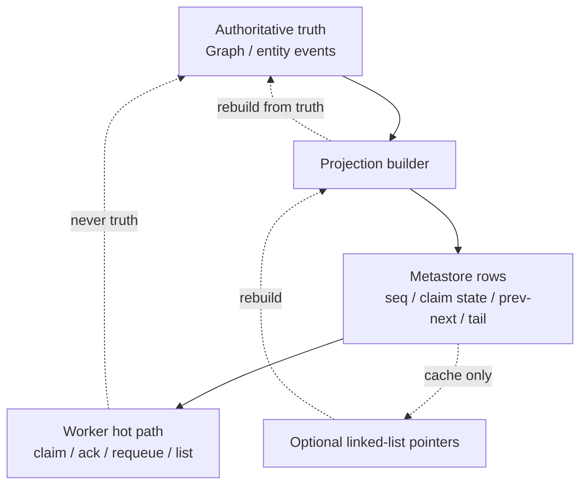
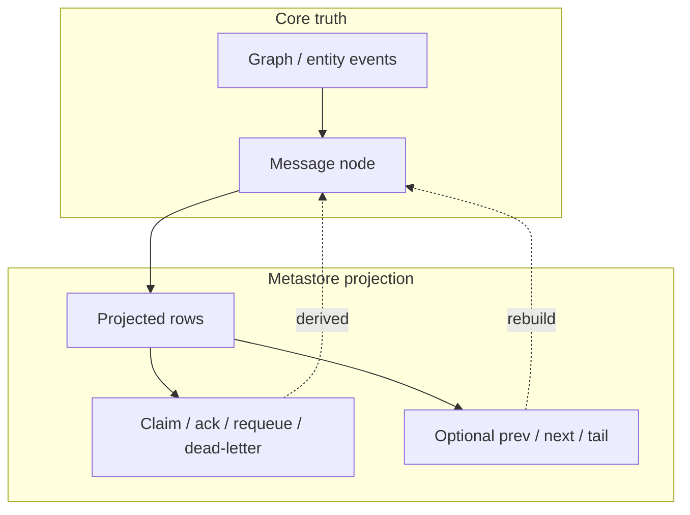
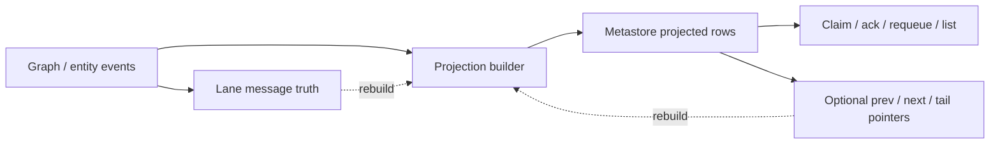
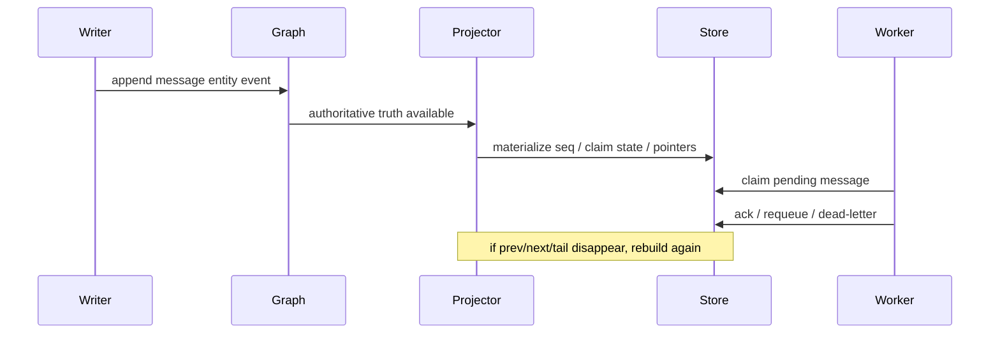

# Lane Messaging Contract

This repo keeps lane messaging contract small and stable:

- `send_message(...)`
- `claim_pending(...)`
- `ack(...)`
- `requeue(...)`
- `dead_letter(...)`
- `list_projected(...)`

Truth split:

- graph/entity event = authoritative message truth
- metastore projection = serving state
- concrete store = storage primitive only

Hard concepts:

- `prev / next / tail` are cache-like pointers, not truth
- if pointer rows vanish or drift, rebuild from graph truth
- worker reads projection, not raw graph, for hot path

Recovery rule:

- projections must rebuild from authoritative truth
- optional linked-list materialization must also rebuild from authoritative truth

Do not turn this into a chimera of extra wrapper layers.
