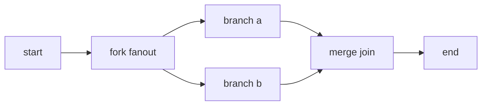
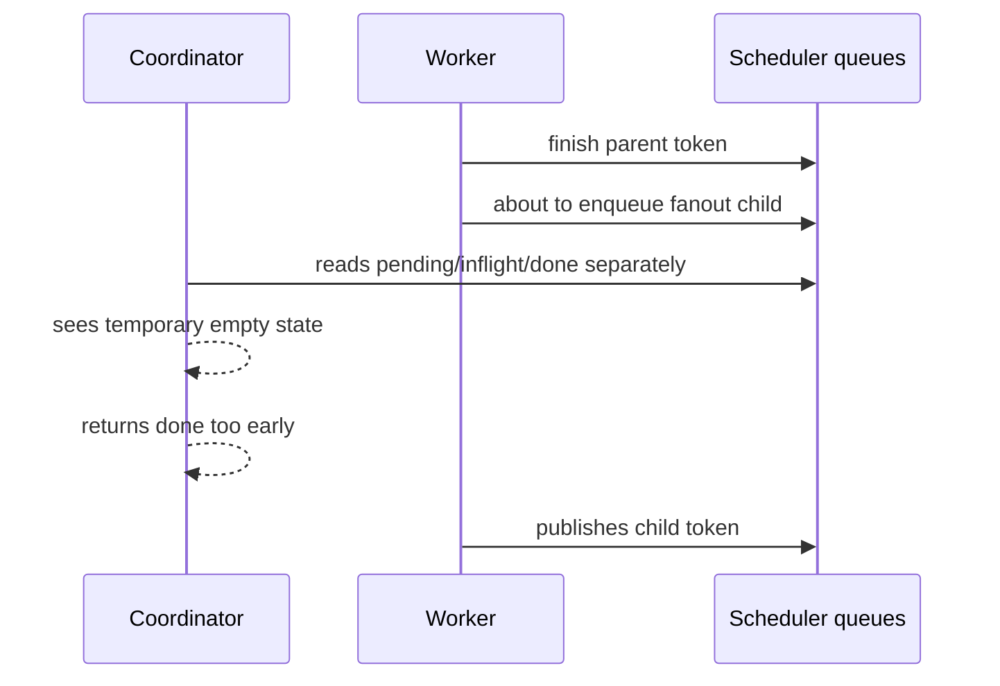
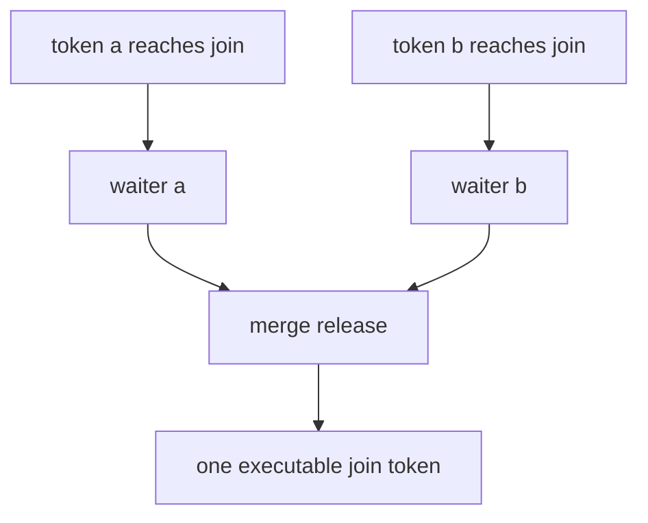

# Runtime Fanout Quiescence And Merge-Join Deadlock

## Summary

The threaded workflow runtime had two related scheduler bugs:

- early completion: the coordinator could observe an empty-looking scheduler snapshot before fanout child work was fully visible
- late non-completion: after a merge join, multiple waiting tokens collapsed into one executable token, but the scheduler work counter still counted the absorbed waiters

Both bugs live in the runtime control plane. They are not fixed by Postgres transactions, because the state involved is scheduler state:

- `scheduled_q`
- `pending_tokens`
- `inflight_tokens`
- `done_q`
- `_join_waiters`
- `work_counter` in the threaded scheduler
- `asyncio.Task`/`pending` lists in the native async scheduler

## Runtime Invariant

Any workflow scheduler may return only when the run is quiescent:

- no scheduled token remains
- no inflight token remains
- no worker result remains unprocessed
- no join waiter can still be released into executable work
- no fanout child can still be published for a completed step
- `work_counter == 0`

For the threaded scheduler, the synchronized source of truth is `work_counter`. It must represent logical outstanding work, not just queued worker tasks.

For the native async scheduler, the equivalent source of truth is the event-loop-local `pending` list plus `inflight` task set and `join_waiters`. It does not need `threading.Condition`, because scheduling state mutates on the event loop, but it still must preserve the same merge invariant.

Shared scheduler-agnostic semantics now live in `BaseRuntime`:

- route selection helper
- initial-state validation
- state-update reducer

This keeps sync and async runtimes from drifting while still allowing each runtime to use its own scheduler primitive family.

## Minimal Shape



## Early Completion Race

Before the fix, completion was based on a snapshot of several structures.



That snapshot was not atomic. A fixed sleep made this less likely, but did not prove correctness.

## Merge-Join Deadlock

After the first fix introduced `work_counter`, a second bug appeared at merge joins.

Two branch tokens arrive at a merge join. The join should collapse them into one executable join token:



The broken counter transition was:

```text
before release: work_counter includes waiter_a + waiter_b
release:        scheduler creates one executable join token
bug:            work_counter still includes both waiters
after end:      one phantom work item remains
result:         run loop waits forever
```

Observed symptom:

- logs show `end` step completed
- no `workflow_run_completed` event appears
- coordinator keeps waking/polling forever

## Threaded Scheduler Fix

The scheduler now uses a `threading.Condition` with a small `work_counter` critical section.

Core rules:

- `_work_add(1)` when a token becomes scheduler-visible
- `_work_done(1)` when a token is fully retired
- fanout publishes child/continuation tokens before retiring the parent
- merge join release converts `N` waiters into one executable token by subtracting `N - 1`
- failed-run cleanup subtracts join waiters when it clears them

The key merge-join correction:

```python
_join_waiters[nid] = []
# N join arrivals collapse into one executable token.
# Keep one outstanding work item for the released join step.
_work_done(max(0, len(waiters) - 1))
```

## Correct Counter Transition

For two branches:

```text
fork publishes a and b:       +2
fork parent retires:          -1
a reaches join and waits:      0   (still outstanding)
b reaches join and releases:   -1  (two waiters become one executable join)
join executes and continues:   0
end retires final token:       -1
quiescent:                     work_counter == 0
```

The exact absolute value depends on surrounding start/end tokens, but the invariant is stable: every logical token added is either retired, parked, or merged into exactly one successor.

## Native Async Scheduler

`AsyncWorkflowRuntime` now uses its native async scheduler for normal `run()` calls. Any sync delegation path is removed; compatibility calls now fail fast instead of falling back to the threaded scheduler.

The native async scheduler uses `asyncio.Task` and event-loop-local scheduler state. It does not use `work_counter`, so the exact threaded deadlock cannot occur there in the same form. The same logical bug class is still possible if merge-join waiters are not collapsed to one successor before completion is evaluated.

Compatibility note: `AsyncWorkflowRuntime` may still keep a small threaded-runtime helper for persistence plumbing, but it no longer delegates execution to it.

Removed delegation paths:

- `experimental_native_scheduler=False`
- `run_sync()`
- `resume_run()`
- resume-marker delegation (`_resume_step_seq` / `_resume_last_exec_node`)

These paths now raise immediately. Native async scheduling is the only supported async execution path.

Pinned async regression:

```text
tests/runtime/test_async_runtime_contract.py::test_async_runtime_native_scheduler_fanout_merge_join_does_not_deadlock
```

That test runs the same minimal fanout -> merge join -> end shape under `AsyncWorkflowRuntime` without opting into threaded compatibility. It wraps the run with `asyncio.wait_for`, so a native async scheduler deadlock fails deterministically.

Additional guard:

```text
tests/runtime/test_async_runtime_contract.py::test_async_runtime_native_scheduler_sync_handlers_run_inline_without_to_thread
```

That test monkeypatches `asyncio.to_thread` to fail. It pins that the native async scheduler is not secretly routing sync handlers through a thread trampoline.

## Lock Discipline

The condition lock protects only in-memory scheduler bookkeeping.

Safe inside the lock:

- increment/decrement `work_counter`
- notify waiters
- read `work_counter`

Unsafe inside the lock:

- DB writes
- network I/O
- resolver/user code
- queue blocking waits
- `await` or await-like work

If the async scheduler later grows cross-task producers that mutate scheduler state outside the current event-loop turn, it should use the same invariant with `asyncio.Condition`, not the same `threading.Condition` object. The current native async scheduler keeps bookkeeping event-loop-local, so no condition object is needed for this fix.

## Regression Tests

`tests/runtime/test_trace_sink_parallel_nested_minimal.py::test_trace_sink_fanout_quiescence_regression_sync`

Pins the early-completion invariant: fanout branches must both start before the run can finish.

`tests/runtime/test_trace_sink_parallel_nested_minimal.py::test_runtime_fanout_merge_join_counter_does_not_deadlock_fake`

Pins the merge-join counter invariant with a minimal fake-backend workflow. It runs in a child process and fails if the child does not exit within the timeout, so a deadlock cannot hang the full pytest process.

`tests/runtime/test_async_runtime_contract.py::test_async_runtime_native_scheduler_fanout_merge_join_does_not_deadlock`

Pins the same shape for the native async scheduler. It uses `asyncio.wait_for` instead of a child process.

## Backend Boundary

This is not a Chroma-only or Postgres-only issue.

Postgres transactions protect persisted rows. They do not protect in-memory runtime scheduling. The bug can occur with fake, Chroma, or Postgres backends if the scheduler bookkeeping is wrong.
