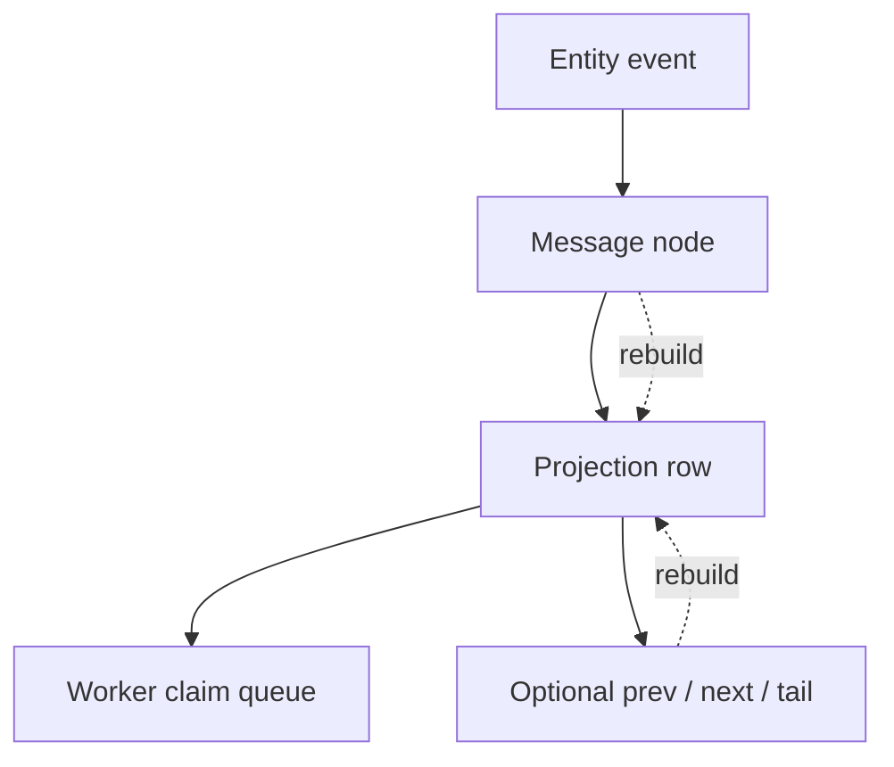
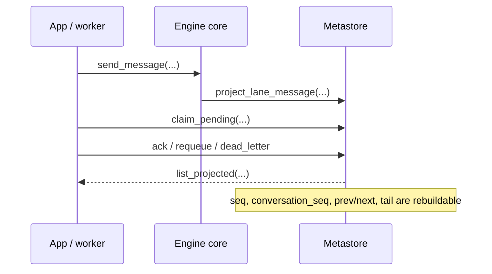

# 23. Lane Messaging Contract

This tutorial explains the stable lane-messaging contract for Kogwistar.
It focuses on the core substrate only and avoids app-specific details.

## Contract

- `send_message(...)`
- `claim_pending(...)`
- `ack(...)`
- `requeue(...)`
- `dead_letter(...)`
- `list_projected(...)`

## Truth Model

- Message truth lives in graph/entity events.
- Projection truth lives in the metastore abstraction.
- Concrete stores provide storage primitives only.
- `meta_sqlite` is the abstraction slot name, not the semantic owner.



## Example

```python
from kogwistar.engine_core.engine import GraphKnowledgeEngine, scoped_namespace

engine = GraphKnowledgeEngine(...)
with scoped_namespace(engine, "ws:demo:conv:bg"):
    sent = engine.send_lane_message(
        conversation_id="conv-demo",
        inbox_id="inbox:worker:demo",
        sender_id="lane:foreground",
        recipient_id="lane:worker:demo",
        msg_type="request.demo",
        payload={"hello": "world"},
    )
    rows = engine.list_projected_lane_messages(inbox_id="inbox:worker:demo")
    claimed = engine.claim_projected_lane_messages(
        inbox_id="inbox:worker:demo",
        claimed_by="worker-1",
        limit=1,
        lease_seconds=30,
    )
    engine.ack_projected_lane_message(
        message_id=sent.message_id,
        claimed_by="worker-1",
    )
```

## Observability

The contract is exposed through query surfaces such as:

- `GET /api/lane/progress`
- `GET /api/workflow/visibility`
- `GET /api/workflow/scheduler/timeline`
- `GET /api/workflow/budget`
- `GET /api/workflow/budget/history`
- `GET /api/workflow/tools/audit`

## Rules

- Do not rely on raw graph scans for inbox consumption.
- Do not treat linked lists as the only source of truth.
- Do not wrap the same contract in multiple semantic layers.


