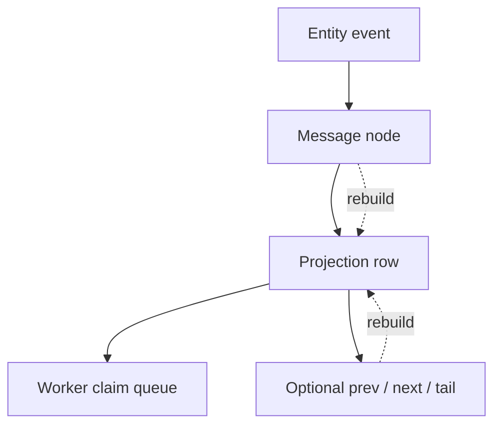
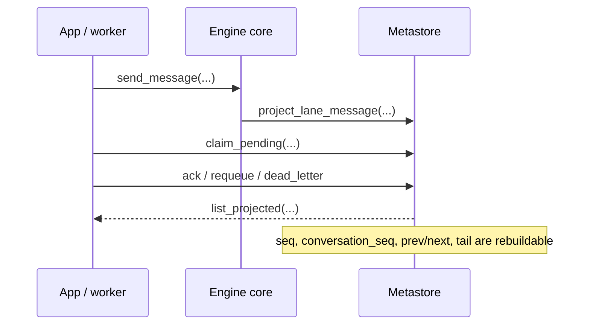

# 23. Lane Messaging Contract

This tutorial explains the stable lane-messaging contract for Kogwistar.
It focuses on the core substrate only and avoids app-specific details.

## Contract

- `send_message(...)`
- `claim_pending(...)`
- `ack(...)`
- `requeue(...)`
- `dead_letter(...)`
- `list_projected(...)`

## Truth Model

- Message truth lives in graph/entity events.
- Projection truth lives in the metastore abstraction.
- Concrete stores provide storage primitives only.
- `meta_sqlite` is the abstraction slot name, not the semantic owner.

## Transaction And Crash Semantics

`send_lane_message(...)` enters the engine unit of work when the engine exposes one
(`engine.uow()` today, with `engine.unit_of_work()` also supported by the service).
The message node, semantic edges, entity events, and projected lane-message row are
written inside that boundary.

The strength of that boundary depends on the active backend:

- Postgres-backed storage can participate in the engine unit of work.
- SQLite metastore operations share the active metastore transaction.
- Chroma-backed graph writes use a no-op backend unit of work, so metastore rollback
  cannot undo a graph write that already reached Chroma.
- In-memory storage preserves API parity for tests and local runs, but has no crash
  persistence promise.

Delivery is at-least-once. If a worker crashes after claiming a projected row and
before acking it, the row can be claimed again after its lease expires. Worker
handlers must therefore be idempotent.

Projection rows are rebuildable from authoritative graph/entity-event truth via
`engine.repair_lane_message_projection(...)`. Daemons should call
`engine.recovery.recover_startup(...)` before polling after restart; that core
coordinator safely repairs missing lane-message projection rows and reports queue,
lane, checkpoint, run-history, dead-letter, daemon-health, and app-output state.
The engine still does not promise exactly-once delivery or automatic resume of
every checkpoint. Resume is policy-gated and at-least-once handlers must remain
idempotent.

For the operator-facing recovery walkthrough, see
[26 Recovery and Durable Operational State](./26_recovery_and_durable_operational_state.md).


```mermaid
flowchart TD
  E[Entity event] --> M[Message node]
  M --> P[Projection row]
  P --> Q[Worker claim queue]
  P --> T[Optional prev / next / tail]
  T -. rebuild .-> P
  M -. rebuild .-> P
```

## Example

```python
from kogwistar.engine_core.engine import GraphKnowledgeEngine, scoped_namespace

engine = GraphKnowledgeEngine(...)
with scoped_namespace(engine, "ws:demo:conv:bg"):
    sent = engine.send_lane_message(
        conversation_id="conv-demo",
        inbox_id="inbox:worker:demo",
        sender_id="lane:foreground",
        recipient_id="lane:worker:demo",
        msg_type="request.demo",
        payload={"hello": "world"},
    )
    rows = engine.list_projected_lane_messages(inbox_id="inbox:worker:demo")
    claimed = engine.claim_projected_lane_messages(
        inbox_id="inbox:worker:demo",
        claimed_by="worker-1",
        limit=1,
        lease_seconds=30,
    )
    engine.ack_projected_lane_message(
        message_id=sent.message_id,
        claimed_by="worker-1",
    )
```

## Observability

The contract is exposed through query surfaces such as:

- `GET /api/lane/progress`
- `GET /api/workflow/visibility`
- `GET /api/workflow/scheduler/timeline`
- `GET /api/workflow/budget`
- `GET /api/workflow/budget/history`
- `GET /api/workflow/tools/audit`

## Rules

- Do not rely on raw graph scans for inbox consumption.
- Do not treat linked lists as the only source of truth.
- Do not wrap the same contract in multiple semantic layers.


```mermaid
sequenceDiagram
  participant App as App / worker
  participant Engine as Engine core
  participant Meta as Metastore

  App->>Engine: send_message(...)
  Engine->>Meta: project_lane_message(...)
  App->>Meta: claim_pending(...)
  App->>Meta: ack / requeue / dead_letter
  Meta-->>App: list_projected(...)
  Note over Meta: seq, conversation_seq, prev/next, tail are rebuildable
```
